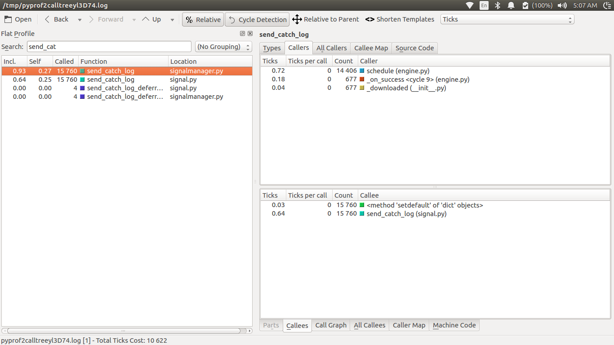
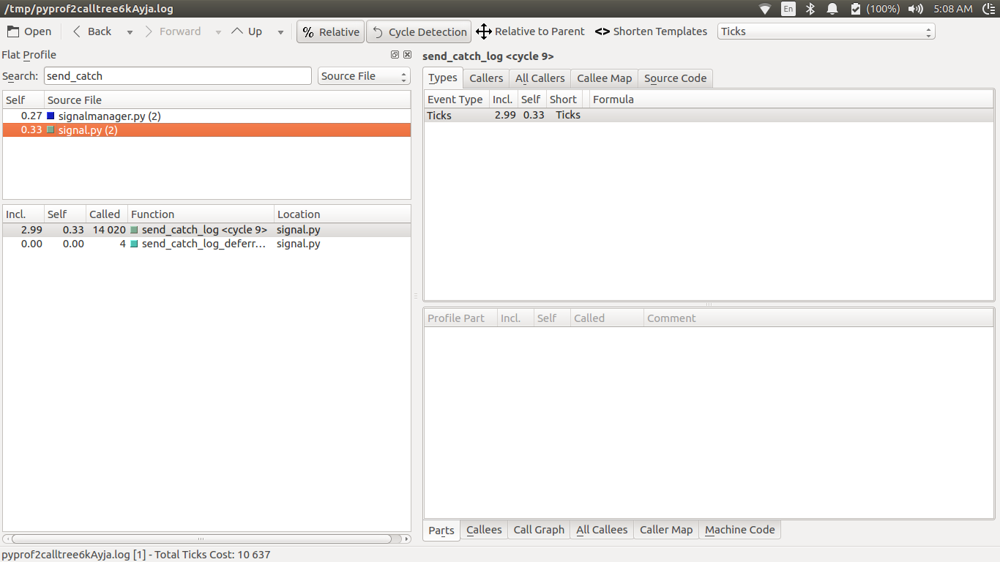

Hi, sorry this post a couple days later than warranted, but there's been some
work that required being taken care of. Since the end of the midterm evaluations,
efforts were concentrated into taking care of issues such as compatability with the
older API of scrapy, unit testing and benchmarking the signal performance with the
new API and looking for places where further optimizations are required.

<span class="more"></span>

One such area I identified was that the `use_caching` functionality of the dispatch lib
was always going unused because of the presence of NoneType objects when a receiver wants
to be triggered on signals sent by any sender. I'm looking into how we can make that usable,
as using the caching we can make the Signals perform even better, since majority of the time taken
by the `send_catch_log` function is in the `_liveReceivers` method of the `Signal` class. This
method would have a constant time look up had it been for the cache.

Here's some preliminary results of the benchmarks, obtained by running the benchmarking spider with
--profile as with:

```bash $scrapy bench --profile -o new_profile.cprofile```

Here's the visualizations of the output obtained using `pyprof2calltree`:


The old API:



As we can see, the difference between the two API's is clear in terms of performance in that the older
API is clearly taking significantly longer time and a lot more cycles than the new API, while the helper methods
of the old dispatcher too are taking their fair share of time(results not in picture). Such is not the case anymore.
Next, I seek to formalize these results in the form of a benchmarking suite and look for ways to improve the
performance even further. Until next time.
