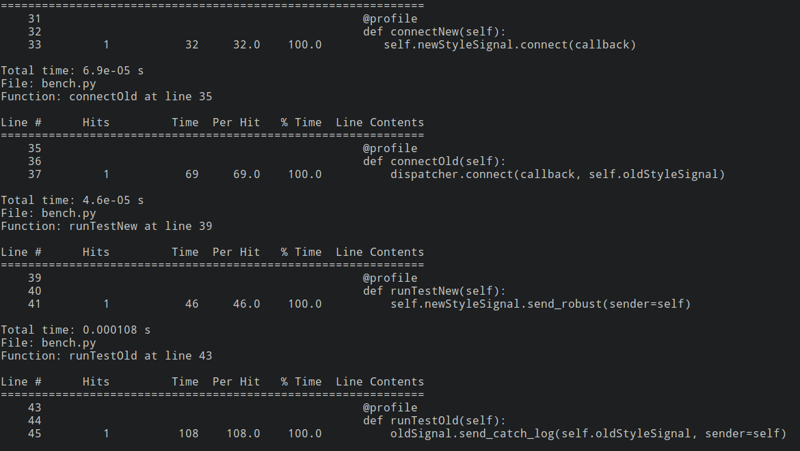

In the past two weeks I focused my efforts on finalizing the benchmarking suite and improving test coverage. 

From what `Codecov` says, we're 83% of the way there regarding test coverage. As far as the performance of the new signals is concerned, from what the testing shows I gathered that the new signal API always takes less than half the time that is required by the old signal API for both signal connection and the actual sending of the signal. 

This is attributed mostly to the fact that a lot of time that was previously used up by running a
combo of the `getAllReceivers` and `liveReceivers` functions together everytime was taking up a huge amount of time and was the bottleneck
to the process. As it currently stands, we're not using the caching mechanism of the library, i.e. have `use_caching` set to false always because
the receivers which do not connect to a specific sender but rather to all require me to find a suitable key for them that can be `weakref` ref'd to
make the entry in the `WeakKeyDictionary`. But enough about that, back to benchmarking.  

So for the benchmarking process, `Djangobech` the `Django`
benchmarking library, does not benchmark the signals currently and the same is still on the `TODO` list in the project. They however, did provide
me with some excellent modules that I used to write the scrapy benchmarking suite for signals. I would leave a link to the same here, but currently
I'm in a discussion with my mentor on where to include them, as including them in the repo would require that we still keep `pyDispatcher` as a dependency
as it is required to perform a raw apples to apples comparison of the signal code. In this post I'm also sharing results that I got using Robert Kern's `line_profiler` module.

.

As for the compatibility changes this cycle, I added support for the old style scrapy signals, which were just standard python objects. In similar
fashion to how I implemented backward compatiblity for receivers without keyword arguments, I proxied the signals through the signal manager to implement backward compatability for the objects. With that the new signals can be safely integrated into scrapy with no worries about breaking legacy code. In the coming weeks, I plan on working on finishing test coverage, maybe adding some signal benchmarks to `scrapy bench` and doing documentation.
